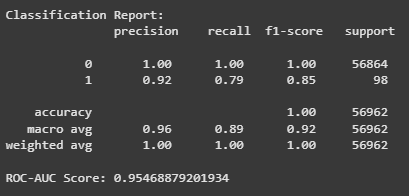
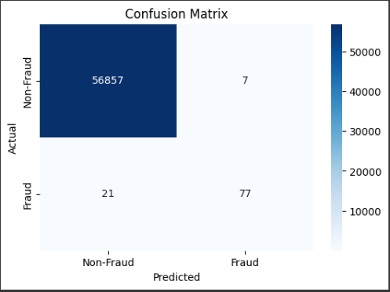
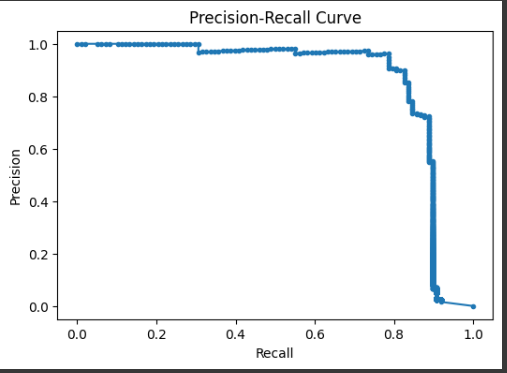
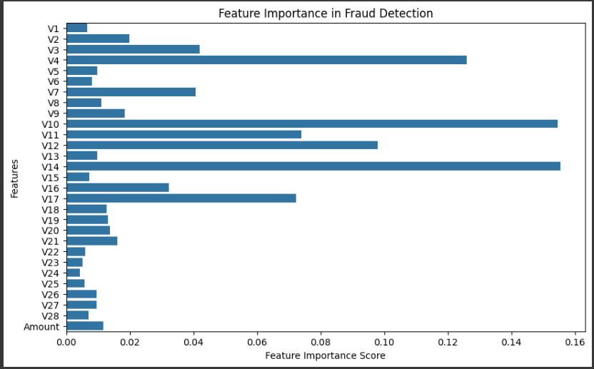

# Credit Card Fraud Detection

## Overview
Financial fraud is an increasing concern in the digital economy, necessitating robust fraud detection mechanisms to mitigate financial losses. This project implements a **machine learning-based fraud detection system** using a **Random Forest Classifier**, a powerful ensemble learning algorithm. The goal is to develop a model capable of accurately classifying fraudulent and non-fraudulent credit card transactions while addressing data imbalances that commonly exist in such datasets.

The dataset used in this project consists of anonymized transaction records, with input features representing various transaction attributes and a binary target variable indicating fraud (`Class = 1`) or non-fraud (`Class = 0`). Given the highly imbalanced nature of fraud detection datasets, we employ advanced **preprocessing techniques** such as feature standardization, data resampling, and class-balancing strategies to improve the model's effectiveness. 

Additionally, model evaluation is conducted using industry-standard classification metrics such as **Precision, Recall, F1-score, ROC-AUC**, and **Confusion Matrix Analysis** to ensure a balance between fraud detection accuracy and false positive reduction. The insights from **feature importance analysis** further aid in understanding key transaction parameters contributing to fraud detection.

## Dataset
- **Source:** The dataset is assumed to be in a file named `creditcard.csv`.
- **Number of Rows:** 284,807
- **Number of Columns:** 31
- **Features:**
  - The dataset contains 30 anonymized numerical features (`V1` to `V28`), `Time`, and `Amount`.
  - `Class` is the target variable, where:
    - `0`: Non-fraudulent transaction.
    - `1`: Fraudulent transaction.
- **Missing Values:** No missing values in the dataset.
- **Class Distribution:**
  - Non-Fraud (0): 99.83%
  - Fraud (1): 0.17%

## Preprocessing Steps
1. **Handling Missing Data**
   - Dropped rows with `NaN` values in the `Class` column.
2. **Feature Selection**
   - Dropped the `Time` column (as it is not relevant).
   - Standardized the `Amount` column using `StandardScaler`.
3. **Train-Test Split**
   - 80% training, 20% testing, stratified by class distribution.
4. **Handling Class Imbalance**
   - Oversampling of the minority class using `resample()`.

## Model Details
- **Algorithm:** `RandomForestClassifier`
- **Hyperparameters:**
  - `n_estimators=200`
  - `max_depth=20`
  - `min_samples_split=5`
  - `min_samples_leaf=2`
  - `bootstrap=True`
  - `random_state=42`

## Evaluation Metrics
- **Classification Report** (Precision, Recall, F1-score)
- **ROC-AUC Score**
- **Confusion Matrix**
- **Precision-Recall Curve**
- **Feature Importance Analysis**

## Results and Analysis
### Classification Report


The classification report demonstrates that the model achieves near-perfect classification for non-fraudulent transactions (Class 0) with **100% precision and recall**. However, fraudulent transactions (Class 1) exhibit a lower recall of **79%**, suggesting that **21% of fraudulent transactions remain undetected**. The **ROC-AUC score of 0.95** indicates a strong discriminative ability of the model in distinguishing fraudulent from non-fraudulent transactions.

### Confusion Matrix


The confusion matrix reveals that out of **98 actual fraud cases**, **21 instances were misclassified as non-fraudulent**, resulting in a **false negative rate that may require further optimization**. Given that fraud detection prioritizes minimizing false negatives, refining the recall metric is imperative.

### Precision-Recall Curve


The precision-recall curve illustrates the trade-off between precision and recall. The steep decline in precision at high recall values suggests that increasing recall may lead to a significant drop in precision. Since fraud detection systems must **prioritize identifying fraudulent transactions with minimal false negatives**, further tuning of the model’s decision threshold may be beneficial.

### Feature Importance in Fraud Detection


The feature importance plot indicates that variables **V4, V10, V14, and V17** are highly influential in detecting fraudulent transactions, whereas the `Amount` feature appears to contribute minimally. This insight can guide **feature engineering efforts and the development of domain-specific fraud detection heuristics**.

## Installation & Usage
### Dependencies
Install required Python libraries using:
```bash
pip install pandas numpy matplotlib seaborn scikit-learn
```

### Running the Code
1. Ensure `creditcard.csv` is in the correct directory.
2. Execute the script:
```bash
python fraud_detection.py
```

## Conclusion and Future Work
The analysis suggests that while the **Random Forest model exhibits strong performance**, there are key areas for further improvement:
- The **false negative rate remains a challenge**, necessitating strategies such as **SMOTE-based oversampling** or alternative classifiers (e.g., **XGBoost or LightGBM**).
- The **decision threshold can be adjusted** to optimize recall without significant loss in precision.
- **Feature selection and engineering** could leverage the insights from feature importance analysis to refine fraud detection mechanisms.

## License
This project is open-source and can be modified and distributed freely.
